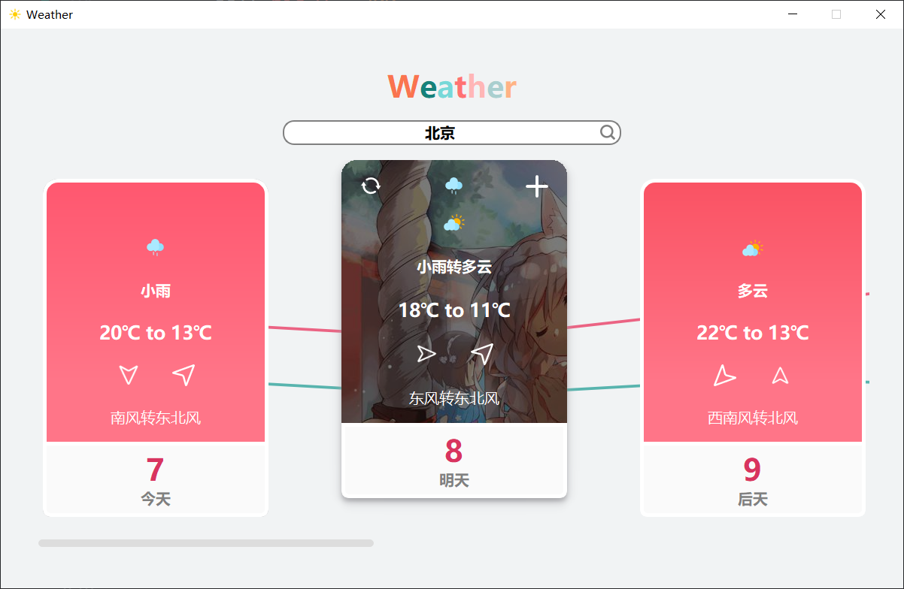

# Beauty | weather | PyQt5
> Design for BNU interview.
> 数据来自中央天气网，灵感来自互联网。

 >从中央天气网获取七天天气数据http://www.weather.com.cn/ 搜索框联想功能，根据输入联想位置名称和城市代码 窗体呈现，每一个卡片在hover时有三个动画，上升一定高度，阴影渐变出现，offset渐变增加，卡片上方按钮渐变出现

## 更新 on 2021 3—10
更新web版本
http://muise.icu
服务器只有一个月，可能一个月后无法访问
### 特色
1 所有曲线过度都有动画
2 双击天气更新当天温度变化趋势
3 双击日期展示当天黄历
4 纯代码实现联想输入框，未使用插件
5 所有数据真实可靠，来自中央天气网，使用腾讯云函数执行python爬取并生成接口供网页使用
ps: 部分功能不兼容ie早期版本，火狐，safria浏览器，chrome最佳。

## 弃坑
学习~

## 更新 on 2020 5-7
1. 背景用matplotlib绘制的最高最低气温的折线图
2. 单击刷新按钮，可以更换照片，由于接口不是很稳，可能需要多点几次吧
3. 加号查看当天日历，如果诸事不宜，可以少活动，多呆在家里吧~

`文件说明`

1. Beauty/pngs 存放icon等资源
2. Beauty/beauty.py 主要代码
3. Beauty/Qss.py 设置StyleSheet用作与代码分离
4. Beauty/beauty.qss qss代码

## 更新 on 2020 5-7

## 1.卡片动画演示

## 2.输入框联想演示

`存在问题`
改变两个渐变按钮透明度时，只能将EndValue设置成不为1的数才可以正常运行，否则两个控件会产生漂移。
`Polygon`
